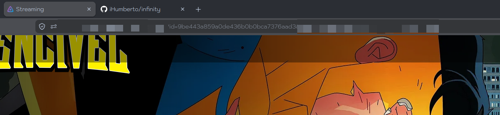
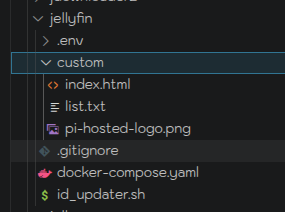
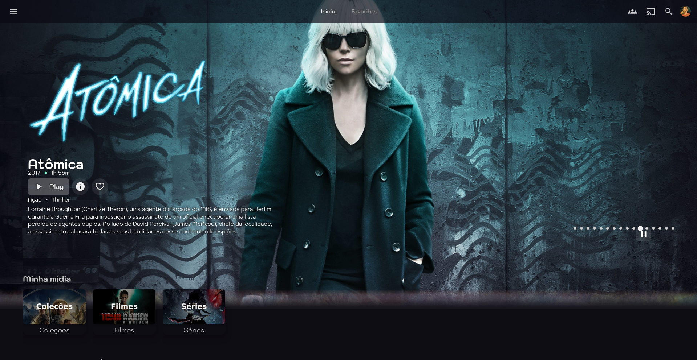
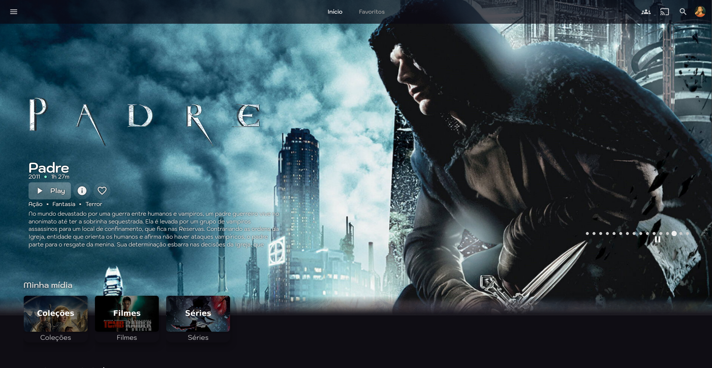
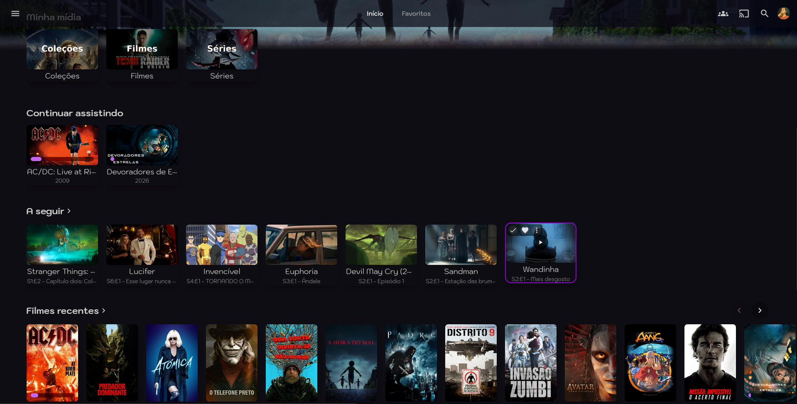
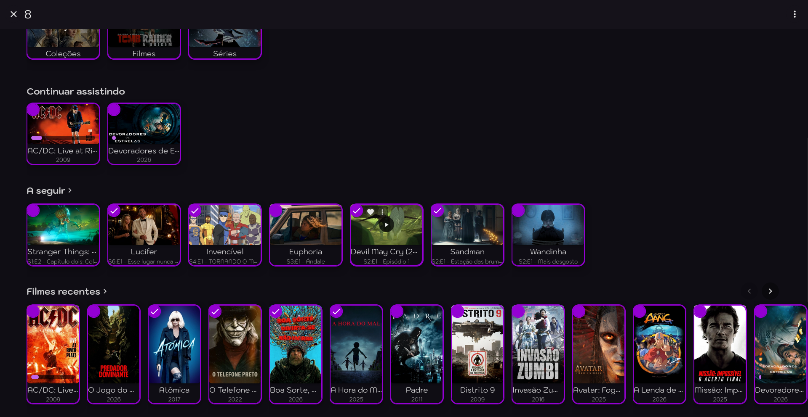
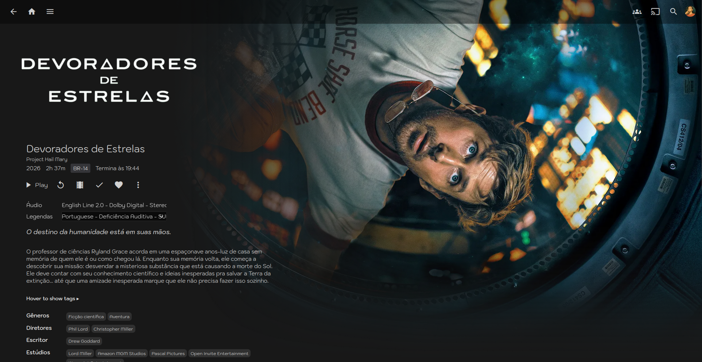
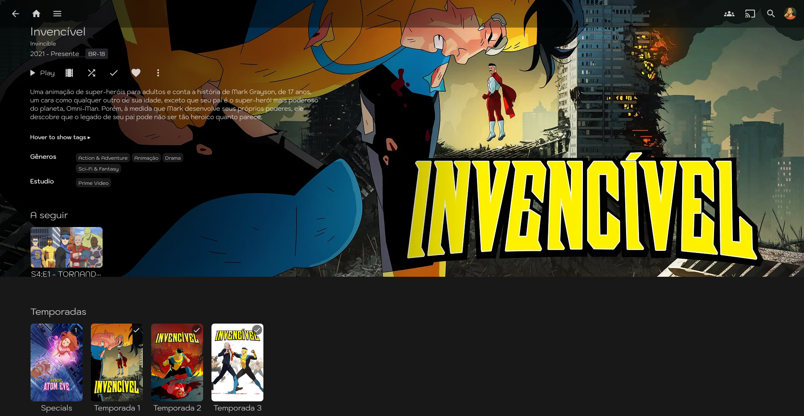
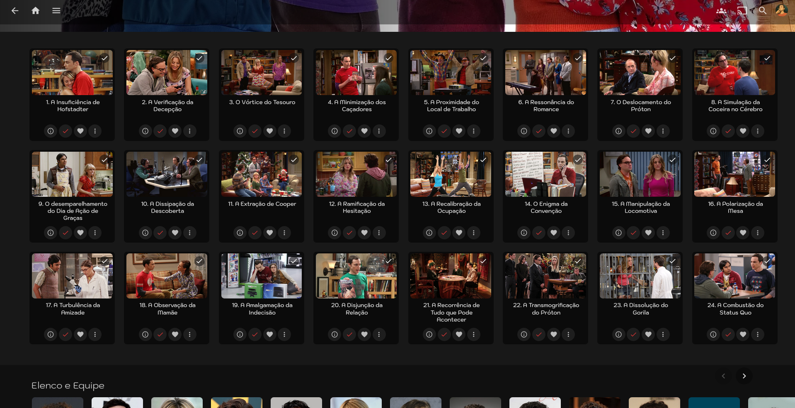
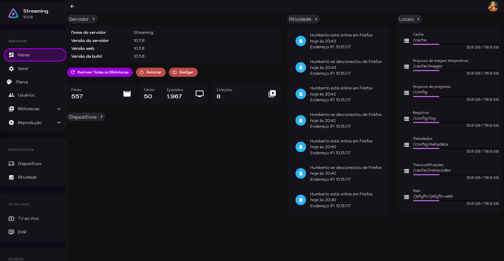

<div align="center">
![Project Stage][Static-Badge]
![Maintenance][maintenance-shield]
![License][license-shield]
<a href="https://forgejo.humbertof.dev/Humberto/infinity/">![Repository][repo-shield]</a>
</div>

# Infinity

Tema customizado para Jellyfin, baseado no [Finity](https://github.com/prism2001/finity) por prism2001.

## O que muda em relação ao Finity

### 🎨 Tema de cores — Dark Purple

Palheta inteira refeita com roxo `#9400D3` como cor primária:

- Fundo da página com undertone roxo (`#9400D3`)
- Cards, header, sidebar e botões com tons de roxo escuro
- Barra de progresso, hover de listas e scrollbar em roxo
- Borda de seleção (multi-select) em roxo
- Checkbox de seleção com fundo roxo e checkmark branco
- Hover de botões com roxo transparente (não mais preto sólido)
- Botão Play com fade roxo no hover
- Gradiente do backdrop do slideshow em tons roxos

### 🖱️ Feedback visual de hover e foco

- Borda roxa ao redor do card no hover do mouse
- Borda roxa ao navegar com controle remoto/teclado (`.focused`)
- List items ganham outline roxo sutil + fundo no hover

### 📐 Layout e páginas de detalhes

- Backdrop ocupa 100% da largura (`--detail-page-backdrop-width: 100vw`, offset 0)
- Máscara lateral com gradiente escuro sólido (sem blur) para legibilidade do texto
- Máscara cobre a área de texto (60vw)
- Temporadas em slider horizontal ocupando 94% da tela
- Episódios em grid com 94% de largura, navegável por setas e touch
- Fonte alterada para **Kodchasan**

### 🎬 Slideshow

- 16 itens (original: 8)
- Slides clicáveis — direcionam para a página do item
- Títulos de episódios clicáveis no grid view
- Intervalo sincronizado com a animação Ken Burns (10s)
- `will-change` em elementos animados para GPU acceleration
- Correção dos dots indicadores de posição
- Correção na inicialização do cronômetro

### 🖥️ Dashboard e páginas de admin

O tema também estiliza a Dashboard de administração (páginas que o CSS customizado do Branding não alcança), usando um arquivo separado (`dashboard.css` carregado no `index.html`):

- Fundo roxo escuro em todas as páginas de admin
- **Painel lateral (sidebar)**: fundo roxo opaco (`#0D0A14`), itens de navegação com formato pill, texto branco, hover roxo com texto preservado, espaçamento entre seções
- **Cards e painéis**: bordas arredondadas (15px), fundo escuro (`#15121A`), consistente com os cards da Home
- **Tipografia**: fonte Kodchasan em todos os componentes MUI (Typography, Button, Input, ListItem, Tab, Chip, Select, etc.)
- **Formulários**: inputs, selects, textareas com fundo escuro e foco roxo
- **Botões**: formato pill em todos os botões (padrão, submit, warning, outlined, text)
- **Scrollbar**: roxa e fina, consistente com o resto do tema
- **Páginas de plugins, metadata manager e configuração** com o mesmo tema visual
- Correção de sobreposição da barra de tabs nas bibliotecas (filmes e séries)

> Veja a seção [Instalação](#instalação) para configurar o `dashboard.css` corretamente.

## Instalação

O Infinity usa **dois arquivos CSS** com responsabilidades diferentes:

| Arquivo | Onde carregar | Páginas que afeta |
|---|---|---|
| `finity-complete.css` | Dashboard > Geral > Branding > CSS Customizado | Home, detalhes, listas, player (páginas do usuário) |
| `dashboard.css` | No `<head>` do `index.html` | Dashboard, admin, configurações, plugins |

> O campo de CSS Customizado do Branding **não** injeta CSS nas páginas de admin/dashboard do Jellyfin — por isso o `dashboard.css` precisa ir no `index.html`.

### 1. Index.html

Cole no final do `<head>` do `index.html` do Jellyfin (antes de `</head>`):

```html
<!-- Infinity — Dashboard styles (admin/config pages) -->
<link rel="stylesheet" href="https://cdn.jsdelivr.net/gh/iHumberto/infinity@main/css/dashboard.css">

<!-- Infinity — Slideshow (home page) -->
<script src="https://cdn.jsdelivr.net/npm/marked@15.0.11/marked.min.js"></script>
<script src="https://cdn.jsdelivr.net/npm/dompurify@3.2.5/dist/purify.min.js"></script>
<link rel="stylesheet" href="https://cdn.jsdelivr.net/gh/iHumberto/infinity@main/css/slideshowpure.css">
<script defer src="https://cdn.jsdelivr.net/gh/iHumberto/infinity@main/js/slideshowpure.js"></script>
<script async src="https://cdn.jsdelivr.net/gh/iHumberto/infinity@main/js/clickableTitles.js"></script>
<script src="https://cdn.jsdelivr.net/gh/iHumberto/infinity@main/js/clickableSlideshow.js"></script>
```

### 2. CSS Customizado (Branding)

No Jellyfin, vá em **Dashboard > Geral > Branding/Marca** e cole no campo **CSS Customizado**:

```css
@import url('https://cdn.jsdelivr.net/gh/iHumberto/infinity@main/css/finity-complete.css');
```

> **Importante:** O `finity-complete.css` deve ser carregado SOMENTE via campo de CSS customizado, **não** no `index.html`. Carregá-lo em ambos os lugares causa carregamento duplicado e não resolve o problema da Dashboard.

### 3. Arquivo list.txt

Crie um arquivo `list.txt` no mesmo diretório do `index.html` com os IDs das mídias do slideshow (um por linha, máximo 16):

```
ID_DO_FILME_1
ID_DO_FILME_2
...
ID_DO_FILME_16
```



Para automatizar, use o [Script Runner](https://github.com/iHumberto/jellyfin-plugin-scriptrunner) com um script que busque as mídias mais recentes.

## Dica — Docker

Crie uma pasta `custom` junto ao `docker-compose.yaml` e monte os arquivos:

```
- ./custom/index.html:/jellyfin/jellyfin-web/index.html
- ./custom/list.txt:/jellyfin/jellyfin-web/list.txt
```



## Screenshots

<div align="center">


</br>


</br>



</div>


## Licença

Este projeto é licenciado sob a [GNU GPL v3](LICENSE).

[maintenance-shield]: https://img.shields.io/maintenance/yes/2026.svg
[Static-Badge]: https://img.shields.io/badge/production-Ready-brightgreen?logo=Forgejo
[repo-shield]: https://img.shields.io/badge/forgejo-repo-brightgreen?logo=forgejo
[license-shield]: https://img.shields.io/badge/License-GNU_GPL_v3-brightgreen?style=flat&logo=gnuprivacyguard